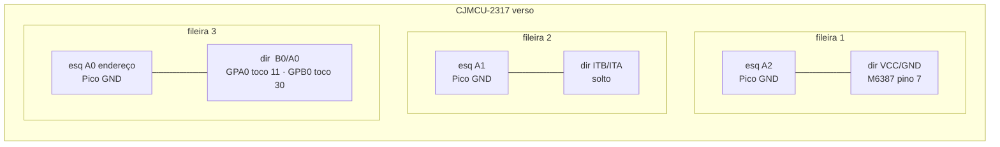
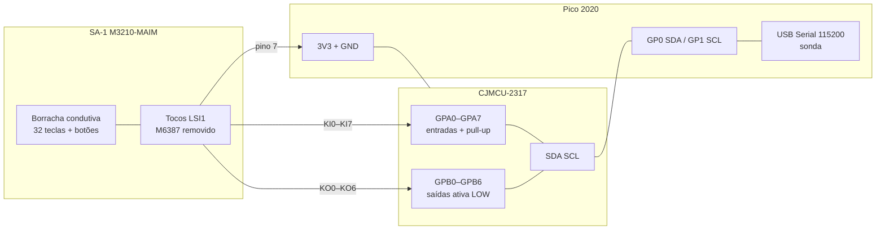
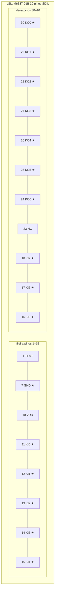
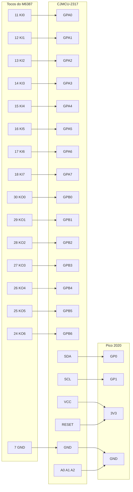
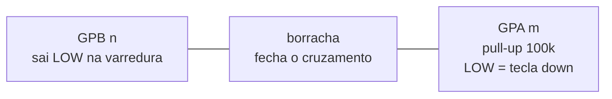

# Etapa 1 — Jump da matriz SA-1 → CJMCU-2317

Nesta etapa **não** ligue encoders nem joystick. Só: isolar o `M6387`, pular os 15 fios da matriz no MCP, e confirmar com a sonda.

Circuito 1:1 (verso da `M3210-MAIM(F)`): [hardware/MATRIZ.md](hardware/MATRIZ.md) · [m3210-maim.svg](hardware/m3210-maim.svg).

Peças agora: placa `M3210-MAIM(F)`, CJMCU-2317, Pico 2020, fios, multímetro.

## Esquemas

### Verso do CJMCU-2317 — 3 fileiras (cima)



| Fileira | Esquerda | Direita |
| --- | --- | --- |
| 1 | A2 → GND | VCC/GND → pino 7 |
| 2 | A1 → GND | ITB/ITA → solto |
| 3 | A0 endereço → GND | B0/A0 → 11 / 30 |

`A0` da esquerda **não** é GPA0. Em `B0/A0`, furo perto do texto = GPA; o outro = GPB.

### Bloco — etapa 1



### Footprint LSI1 — pino 1

Chanfro / seta da silk = pino 1. Esquerda 1→15 (para baixo), direita 30→16 (para baixo).



★ = soldar cambo. Pinos 16–18 estão no canto inferior direito (depois do 15, a contagem sobe pelo outro lado: 16, 17, 18).

### Jump — matriz + I2C



### Uma tecla (como o MCP lê)



F3 = KO0+KI0 = toco 30 + toco 11. C6 = KO3+KI7 = toco 27 + toco 18. Multímetro: continuidade entre esses pares, **não** contra o pino 7.

## 1. Achar o pino 1

Lado dos **componentes**. O `M6387` é o SDIL de 30 pinos (mais estreito que DIP). Chanfro ou ponto = pino 1.

```
          chanfro
     1 ●              30  KO0
     2                29  KO1
     3                28  KO2
     ...              27  KO3
    10 VDD            26  KO4
    11 KI0            25  KO5
    12 KI1            24  KO6
    13 KI2            23  (não usar)
    14 KI3            22
    15 KI4            21
    ----------------
    16 KI5   17 KI6   18 KI7   … até 16 embaixo à direita
```

Contagem DIP: esquerda 1→15 (de cima para baixo), direita 16→30 (de baixo para cima).  
Os furos no meio da face de solda da foto **são esses pinos**. Marque o pino 1 com caneta antes de virar a placa — no lado da solda a imagem está espelhada.

Pinos que importam:

| Função | M6387 |
| --- | --- |
| KI0–KI7 | 11, 12, 13, 14, 15, 16, 17, 18 |
| KO0–KO6 | 30, 29, 28, 27, 26, 25, 24 |
| GND | 7 |

`KO7` (pino 23) no SA-1 não varre tecla. Ignore.

## 2. Isolar o chip (melhor: remover)

O MCP não pode dividir o barramento com o `M6387`. **Tirar o chip inteiro é o isolamento mais limpo** — melhor que cortar 15 trilhas. Sem o OKI, as linhas KI/KO ficam só na matriz + pads vazios.

É SDIL (passo mais estreito que DIP comum) numa placa de uma face, fácil de arrancar pad. Não force com sucção de uma vez.

1. Marque o pino 1 (chanfro) com caneta **antes** de sair o chip.
2. Com alicate de corte, seccione os 30 pinos **rente ao encapsulamento**. O corpo sai; os tocos ficam nos furos.
3. Dessolde cada toco, um a um, com malha dessoldadora. Sem alavancar o pad.
4. Pode **manter os tocos** dos pinos e soldar os cambos neles (estaqueie com um pouco de solda). Não precisa arrancar o metal do furo. Use os tocos 11–18, 24–30 e o 7 (GND), ou outro GND da placa.

Pilhas / DC 6 V **fora**. O 4558 e os jacks podem ficar.

## 2b. Teste com o multímetro (fazer isto agora)

Pilhas e DC **desligados**. Modo **continuidade** (apito) ou ohms — **não** volts. Sem o chip e sem fonte, as linhas da matriz não têm tensão.

A tecla **não fecha contra o GND**. Ela só une um `KO` a um `KI`. Com a ponta preta no pino 7 você **não** ouve apito ao apertar tecla. Isso é normal.

### O que o pino 7 serve

Ponta preta no **7**. Ponta vermelha nos outros tocos, **sem** apertar tecla:

| Apita? | Toco | Significado |
| --- | --- | --- |
| Sim | 1, 2, 6 | TEST / AGND, também no terra — ignore para a matriz |
| Não | 11–18, 24–30 | Candidatos KI/KO — bons |

Se 11–18 ou 24–30 apitarem com o 7, o pad está em curto com o terra (trilha rasgada ou solda). Não pule esses.

### Mapear a matriz (42 toques — 32 teclas + 0–9)

USB do Pico **fora**. Pilhas / DC fora. Multímetro em **continuidade** ou **ohms** — não DC volts. Borrachas no sítio.

A coluna da direita é hipótese (manual PK-5 / SA-1). O dado é o par que **apita**. Se o esperado falhar, deixe a tecla premida e varra os outros KI (11–18), depois os outros KO (30…24). Anote o par real.

MCP pode ficar ligado: caminho da borracha = **100 Ω–2 kΩ**. Apito **sem** tecla, ou ohms muito baixos (~0 Ω) = curto de cambo/solda, não a borracha.

**Como medir uma tecla**

1. Ponta **preta** no toco KO da linha.
2. Ponta **vermelha** no toco KI da coluna.
3. Sem tecla: aberto / OL. Apertar: apito. Soltar: abre.
4. Se apitar noutro KI além do esperado, anote os dois — é curto ou KO trocado.

Tocos: KI0–7 = **11 12 13 14 15 16 17 18**. KO0–6 = **30 29 28 27 26 25 24**.

#### Piano — KO0 toco 30 (F3 … C4)

Preta **fixa no 30**. Vermelha muda. Teclas da esquerda para a direita, cromático (brancas e pretas).

| Apertar | Vermelha | Esperado |
| --- | --- | --- |
| F3 (branca mais grave) | 11 | KO0 KI0 |
| F#3 | 12 | KO0 KI1 |
| G3 | 13 | KO0 KI2 |
| G#3 | 14 | KO0 KI3 |
| A3 | 15 | KO0 KI4 |
| A#3 | 16 | KO0 KI5 |
| B3 | 17 | KO0 KI6 |
| C4 | 18 | KO0 KI7 |

#### Piano — KO1 toco 29 (C#4 … G#4)

Preta **no 29**.

| Apertar | Vermelha | Esperado |
| --- | --- | --- |
| C#4 | 11 | KO1 KI0 |
| D4 | 12 | KO1 KI1 |
| D#4 | 13 | KO1 KI2 |
| E4 | 14 | KO1 KI3 |
| F4 | 15 | KO1 KI4 |
| F#4 | 16 | KO1 KI5 |
| G4 | 17 | KO1 KI6 |
| G#4 | 18 | KO1 KI7 |

#### Piano — KO2 toco 28 (A4 … E5)

Preta **no 28**.

| Apertar | Vermelha | Esperado |
| --- | --- | --- |
| A4 | 11 | KO2 KI0 |
| A#4 | 12 | KO2 KI1 |
| B4 | 13 | KO2 KI2 |
| C5 | 14 | KO2 KI3 |
| C#5 | 15 | KO2 KI4 |
| D5 | 16 | KO2 KI5 |
| D#5 | 17 | KO2 KI6 |
| E5 | 18 | KO2 KI7 |

#### Piano — KO3 toco 27 (F5 … C6)

Preta **no 27**.

| Apertar | Vermelha | Esperado |
| --- | --- | --- |
| F5 | 11 | KO3 KI0 |
| F#5 | 12 | KO3 KI1 |
| G5 | 13 | KO3 KI2 |
| G#5 | 14 | KO3 KI3 |
| A5 | 15 | KO3 KI4 |
| A#5 | 16 | KO3 KI5 |
| B5 | 17 | KO3 KI6 |
| C6 (branca mais aguda) | 18 | KO3 KI7 |

#### Botões 0–4 — KO4 toco 26

Preta **no 26**.

| Apertar | Vermelha | Esperado |
| --- | --- | --- |
| 0 | 11 | KO4 KI0 |
| 1 | 12 | KO4 KI1 |
| 2 | 13 | KO4 KI2 |
| 3 | 14 | KO4 KI3 |
| 4 | 15 | KO4 KI4 |

#### Botões 5–9 — KO5 toco 25

Preta **no 25**.

| Apertar | Vermelha | Esperado |
| --- | --- | --- |
| 5 | 11 | KO5 KI0 |
| 6 | 12 | KO5 KI1 |
| 7 | 13 | KO5 KI2 |
| 8 | 14 | KO5 KI3 |
| 9 | 15 | KO5 KI4 |

### Se não bater

| Sintoma | O que fazer |
| --- | --- |
| F3 não fecha 30↔11 | Pino 1 invertido. Tecla premida, varra 11–18 e 30…24; manda o par que apitar |
| Fecha no KI certo **e** noutro | Curto entre esses KI (cambo ou solda no par `Bn/An` do CJMCU) |
| F3 fecha 30↔11 **e** 26↔11 | Curto KO0–KO4 (tocos **30** e **26**, GPB0/GPB4) |
| A#3/B3/C4 mudos (16/17/18) | Cambos KI5–7 no furo **B** em vez do **A**, ou curto com o toco **25** |
| Apita **sem** tecla | Curto permanente. Não pule esses fios |
| Ω ~0 com tecla | Curto metálico, não borracha |
| 100 Ω–2 kΩ com tecla, abre ao soltar | Par bom |

Manda o resultado **linha a linha** (ex. `F3  30↔11  ok` ou `F3  30↔15`). Não feche o mapa no firmware até as 32 + 0–9 estarem anotadas.

## 3. Ligar os cambos no CJMCU

Ordem no ferro, lista para ir riscando e verso do módulo: [hardware/SOLDA-MCP.md](hardware/SOLDA-MCP.md) · [cjmcu-2317-solda.svg](hardware/cjmcu-2317-solda.svg).

Verso do módulo, texto `CJMCU` legível. `B0/A0` é **dois furos**: o mais perto do texto = **GPA**; o do outro lado = **GPB**.  
Não use o `A0` da **coluna esquerda** (endereço).

### Dos tocos LSI1 → MCP

| Cambo no toco | Silk no verso | Furo do par |
| --- | --- | --- |
| 11 | B0/A0 | GPA (perto do texto) |
| 12 | B1/A1 | GPA |
| 13 | B2/A2 | GPA |
| 14 | B3/A3 | GPA |
| 15 | B4/A4 | GPA |
| 16 | B5/A5 | GPA |
| 17 | B6/A6 | GPA |
| 18 | B7/A7 | GPA |
| 30 | B0/A0 | GPB (lado oposto) |
| 29 | B1/A1 | GPB |
| 28 | B2/A2 | GPB |
| 27 | B3/A3 | GPB |
| 26 | B4/A4 | GPB |
| 25 | B5/A5 | GPB |
| 24 | B6/A6 | GPB |
| 7 | GND | coluna esquerda |

Toco 23 e o GPB7 de `B7/A7` ficam soltos.

### CJMCU → Pico (para a sonda)

| Silk esquerda | Pico |
| --- | --- |
| VCC | 3V3 |
| GND | GND (junto com o toco 7) |
| SDA/SI | GP0 |
| SCL/SCK | GP1 |
| RESET | 3V3 |
| A0, A1, A2 | GND |
| NC/SO, NC/CS, ITB/ITA | soltos |

Só 3,3 V. Sem VBUS / 5 V.

---

Tudo em 3,3 V. Sem 5 V nesta etapa.

## 4. Teste agora (Pico + CJMCU soldados)

Arduino IDE:

1. Placa **Raspberry Pi Pico** (Earle Philhower, não o Mbed).
2. Biblioteca **Adafruit MCP23017** (Library Manager).
3. Porta USB do Pico → grave `firmware/probe/probe.ino`.
4. Serial Monitor **115200**.

| Serial / LED | Significado |
| --- | --- |
| `MCP OK em 0x20` + LED aceso | I2C certo. Pode apertar tecla |
| `achou 0x21`…`0x27` | A0–A2 não estão todos no GND |
| `nenhum dispositivo` + LED piscando rápido | VCC, GND, RESET, SDA/SCL |

Com I2C ok e borrachas no lugar: F3 → `DOWN  KO0 KI0  F3`.

Com o MCP OK, aperte nesta ordem:

| Apertar | Serial esperado | Se vier outro par |
| --- | --- | --- |
| F3 (branca mais grave) | `KO0 KI0  F3` | KI trocado ou KO invertido |
| C6 (branca mais aguda) | `KO3 KI7  C6` | mesma coisa |
| C4 (8ª tecla) | `KO0 KI7  C4` | colunas deslocadas |
| Botão `0` | `KO4 KI0  0` | linhas de botão (KO4–KO6) |

Aperte as 32 teclas e anote qualquer linha que não bata. **Não feche o mapa ainda.** O nome à direita (`F3`, `0`, …) é só uma hipótese.

### Aprender o mapa (sonda expandida)

Grave de novo `firmware/probe/probe.ino`. Serial **115200**. No monitor, envie `l` e Enter.

A sonda pede **44** toques, um de cada vez, largar antes do seguinte:

1. As 32 teclas **F3 → C6** (cromático, incluindo pretas).
2. Botões **0–9**, depois `stop` e `demo`. Sem tempo / volume / rhythm da placa (volume = EC11).

Se um passo não existir ou não responder: envie `n` (saltar).

Cada `DOWN` mostra o cruzamento cru e **quatro** nomes:

| Campo | Significado |
| --- | --- |
| `KO4 KI3` | O que o MCP leu (isto é o dado) |
| `Casio:` | Mapa publicado (weltenschule) |
| `KIrev:` | Se KI0–7 estiverem invertidos no cabo |
| `KOrev:` | Se KO0–6 estiverem invertidos |
| `ambos:` | Os dois invertidos |
| `held` | Todas as células baixas **agora**. Mais de uma (além de `S`) = curto ou fantasma |
| `S` | Colado no arranque (ex. stop/demo). Ignorado no aprender |

No fim aparece um bloco `--- aprendido ---`. Copia isso para o chat **antes** de alterar `firmware/pico/matrix.h`.

Outros comandos: `h` ajuda, `m` mapa já, `c` limpa `#` vistos, `r` sai do aprender.

## 5. Pronto para a etapa 2 quando

- [ ] MCP responde em `0x20`
- [ ] F3 = KO0 KI0 e C6 = KO3 KI7
- [ ] Botões 0–9 e stop/demo nas linhas KO4–KO6 (tempo / vol / rhythm da placa: ignorados)
- [ ] Nenhuma tecla dispara sozinha (GND comum + isolamento ok)

Aí: [Etapa 2](ETAPA-2.md) — OLED, EC11, KY-023, WS2812, PCM5102A.
