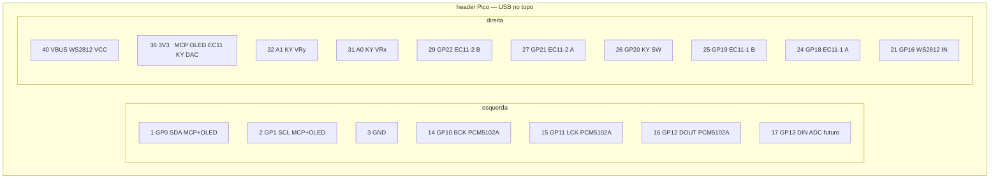
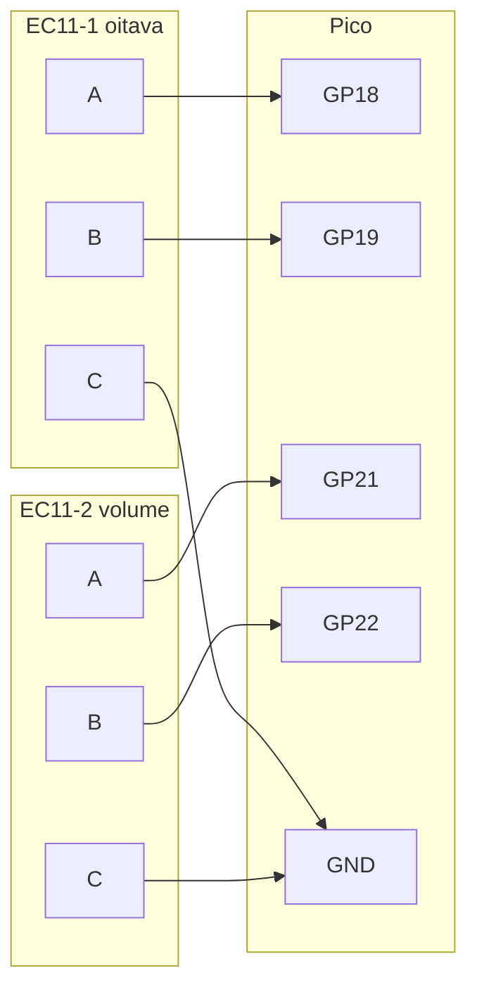
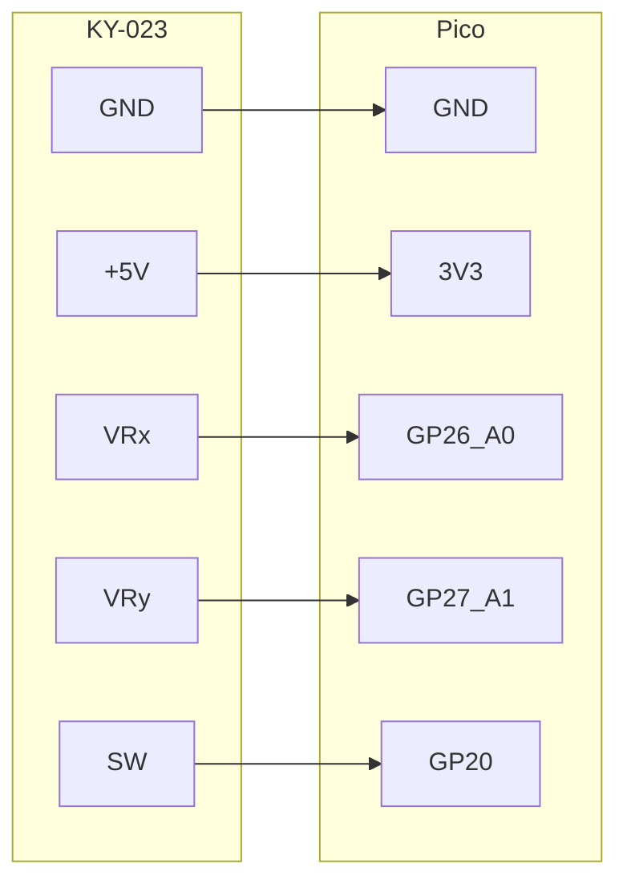
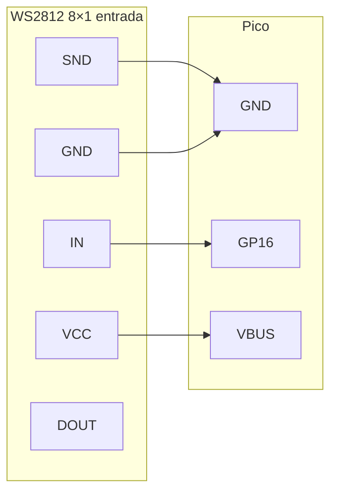
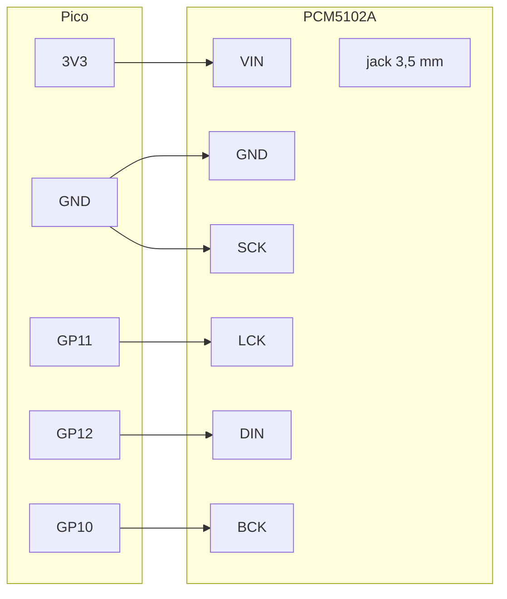

# Etapa 2 — Wiring dos periféricos (além da matriz)

Matriz já ok: [Etapa 1](ETAPA-1.md). Agora ligar no **Pico 2020**: OLED, 2× EC11, KY-023, WS2812 e PCM5102A.

O CJMCU-2317 **já está** em GP0/GP1 (I2C). O OLED entra no mesmo barramento. Não desligue o MCP.

Pilhas / DC 6 V fora. Pico só em USB. Lógica **3,3 V**, excepto a barra WS2812 (VBUS 5 V).

## Bloco

```mermaid
flowchart LR
  subgraph PICO["Pico 2020"]
    I2C["GP0 SDA / GP1 SCL"]
    ENC["GP18/19  GP21/22"]
    JOY["A0 A1 GP20"]
    WS["GP16"]
    I2S["GP10 GP11 GP12"]
    P3V["3V3"]
    V5["VBUS 5 V"]
    GND["GND"]
  end

  OLED["OLED 0.91\" SSD1306"]
  MCP["CJMCU-2317"]
  E1["EC11-1 oitava"]
  E2["EC11-2 volume"]
  KY["KY-023"]
  LED["WS2812 8×1"]
  DAC["PCM5102A"]

  I2C --- OLED
  I2C --- MCP
  ENC --- E1
  ENC --- E2
  JOY --- KY
  WS --- LED
  I2S --- DAC
  P3V --- OLED
  P3V --- MCP
  P3V --- E1
  P3V --- E2
  P3V --- KY
  P3V --- DAC
  V5 --- LED
  GND --- OLED
  GND --- MCP
  GND --- E1
  GND --- E2
  GND --- KY
  GND --- LED
  GND --- DAC
```

## Pico 2020 — pinos usados

USB em cima. Esquerda = GP0…GP15. Direita = VBUS…GP16.



| Pico | Vai para |
| --- | --- |
| GP0 | SDA — CJMCU + OLED |
| GP1 | SCL — CJMCU + OLED (silk do OLED diz **SCK**) |
| GP10 | PCM5102A BCK |
| GP11 | PCM5102A LCK |
| GP12 | PCM5102A DIN (Pico DOUT) |
| GP13 | livre — I2S DIN para ADC no modo entrada |
| GP16 | WS2812 IN |
| GP18 / GP19 | EC11-1 oitava A / B |
| GP20 | KY-023 SW |
| GP21 / GP22 | EC11-2 volume A / B |
| **GP26_A0** / **GP27_A1** | KY-023 VRx / VRy |
| **GP28_A2** | livre (ADC) |
| 3V3 | MCP, OLED, EC11 (se módulo), KY-023 `+5V`, PCM5102A VIN |
| VBUS | **só** WS2812 `VCC` |
| GND | todos |

GP2–GP9, GP14, GP15, GP17 livres. **A2** (GP28) também. Não use 5 V no KY-023 nem no OLED.

---

## OLED 0.91" SSD1306 (128×32, 4 pinos)

Silk: **GND · VCC · SCK · SDA**. `SCK` = SCL do I2C, **não** é SPI. Mesmo barramento do CJMCU (`0x20` MCP, `0x3C` OLED).

```mermaid
flowchart LR
  subgraph OLED["OLED 0.91\""]
    OG["GND"]
    OV["VCC"]
    OS["SCK"]
    OD["SDA"]
  end

  subgraph PICO["Pico"]
    PG["GND"]
    P3["3V3"]
    GP1["GP1"]
    GP0["GP0"]
  end

  OG --> PG
  OV --> P3
  OS --> GP1
  OD --> GP0
```

| OLED | Pico | Por quê |
| --- | --- | --- |
| GND | GND | |
| VCC | **3V3** | 5 V queima o painel |
| SCK | GP1 | SCL — o mesmo do MCP |
| SDA | GP0 | SDA — o mesmo do MCP |

Sem fio de RESET. Pull-up já vem no módulo e no CJMCU. Se a sonda imprimir `OLED 0x3D`, mude `OLED_ADDR` em `firmware/pico/config.h`. Sem display o firmware segue.

Sonda: `OLED OK  0x3C` no self-test. Lab: pill OLED verde.

---

## 2× EC11 sem clique

Três pinos no encoder: **A · C · B** (C no meio). Sem switch — programa pelos botões 0–9 da Casio. `INPUT_PULLUP` no Pico, sem resistor extra.



| Encoder | Pino | Pico |
| --- | --- | --- |
| EC11-1 oitava | A | GP18 |
| EC11-1 oitava | C (meio) | GND |
| EC11-1 oitava | B | GP19 |
| EC11-2 volume | A | GP21 |
| EC11-2 volume | C (meio) | GND |
| EC11-2 volume | B | GP22 |

Se o giro inverter o sentido, troque A↔B nesse encoder (ou os dois fios no Pico).

Módulo KY-040 / placa com 5 pinos (`CLK DT SW + −`): ignore `SW`; `CLK`/`DT` = A/B; `+` **não** precisa (o Pico já puxa). Se ligar `+`, use **3V3**, nunca 5 V.

Sonda: gire → `EC11-1  +  count=` / `EC11-2`. Lab: números E1 / E2.

---

## Joystick KY-023

Cinco pinos. O silk `+5V` (às vezes `VCC`) é só o VCC dos pots ~10 kΩ. No Pico: **3V3**. Em 5 V, VRx/VRy passam de 3,3 V e queimam o ADC.

ADC do Pico no canto (USB em cima, **solda**: coluna da esquerda): silk **GP26_A0 · GP27_A1 · AGND · GP28_A2**.

| Silk Pico | GPIO | ADC | KY-023 |
| --- | --- | --- | --- |
| **GP26_A0** | GP26 | ADC0 | VRx |
| **GP27_A1** | GP27 | ADC1 | VRy |
| AGND | — | — | (pode ser terra do stick) |
| **GP28_A2** | GP28 | ADC2 | nada |



| KY-023 | Pico | Por quê |
| --- | --- | --- |
| GND | GND | |
| **+5V** | **3V3** | nunca VBUS |
| VRx | **GP26_A0** | pitch bend |
| VRy | **GP27_A1** | CC 1 mod |
| SW | GP20 | sustain (pull-up interno, LOW = clique) |

Stick **solto** ao ligar — o firmware calibra o centro no boot. Eixo invertido: `JOY_INVERT_X` / `JOY_INVERT_Y` em `config.h`.

Sonda: `JOY  centro X=… Y=…` ~2048. Mexa → `JOY  X= Y= SW=`. Clique: `SW=1`. Lab: cruz no canvas.

---

## WS2812 8×1 (5050)

Silk do lado de **entrada**: **SND · IN · VCC · GND**. (`SND` = terra. `IN` = dados.) O outro extremo é **DOUT** para encadear — deixe solto.



| Barra | Pico |
| --- | --- |
| SND | GND |
| IN | GP16 |
| VCC | **VBUS** (5 V no USB) |
| GND | GND |
| DOUT | nada |

8 brancos no máximo ~0,5 A — por isso **VBUS**, não o 3V3 do Pico. `IN` aceita 3,3 V. Cores erradas: 330 Ω entre GP16 e IN.

Firmware ainda **não** acende (`WS_PIN` / `WS_COUNT` em `config.h`). Ligação só.

---

## PCM5102A (porta OUT / CLOCK / IN)

Módulo roxo, jack **3,5 mm LINE OUT**. Fileira de cima: **VIN · GND · LCK · DIN · BCK · SCK**.

O chip **só faz DAC**. Modos **saída** e **clock** saem neste jack. **Entrada** não: não ligue fonte no jack (é saída). ADC futuro no GP13.



| PCM5102A | Pico | Por quê |
| --- | --- | --- |
| VIN | **3V3** | LDO no módulo |
| GND | GND | |
| LCK | **GP11** | LRCK = BCK+1 |
| DIN | **GP12** | Pico DOUT |
| BCK | **GP10** | bit clock |
| SCK | **GND** | PLL. **Não** é o SCK do OLED |
| 1 2 3 4 | nada | jumpers no verso |
| G R G L | nada | mesmo sinal do jack |

Verso — ponte no meio para L ou H:

| Pad | Certo |
| --- | --- |
| H1L FLT | L |
| H2L DEMP | L |
| H3L XSMT | **H** (unmute) |
| H4L FMT | L (I2S) |

Ponte SCK–GND na frente: se estiver fechada, o fio SCK→GND é opcional.

Firmware ainda **não** gera áudio. Detalhe dos modos: [README](README.md#pcm5102a--porta-out--clock--in).

---

## Ordem de solda

1. OLED no I2C (GP0/GP1 + 3V3 + GND). Grave a sonda. Self-test: `OLED OK`.
2. EC11-1 em GP18/19, C no GND. Gire → count na sonda / Lab.
3. EC11-2 em GP21/22. Idem.
4. KY-023: `+5V` no **3V3**, VRx **GP26_A0**, VRy **GP27_A1**, SW GP20. Stick solto no boot.
5. WS2812: IN GP16, VCC **VBUS**, SND e GND no GND. Sem teste de LED ainda.
6. PCM5102A: VIN 3V3, SCK no GND, LCK/DIN/BCK em GP11/12/10.

Matriz (CJMCU) já ligada da [etapa 1](ETAPA-1.md) — não mexa nos cambos KI/KO.

## Pronto quando

- [ ] Sonda: `MCP OK` e `OLED OK  0x3C`
- [ ] EC11-1 e EC11-2 mudam count no Lab
- [ ] Stick move o canvas; clique = SW
- [ ] WS2812 e PCM5102A só conferidos no multímetro (continuidade nos pinos acima)
- [ ] Nada em 5 V excepto VBUS → WS2812

Aí grave `firmware/pico` (**Gravar MIDI** no Lab) — USB-MIDI com encoders, joystick e OLED. Synth / clock / LEDs: firmware depois.
