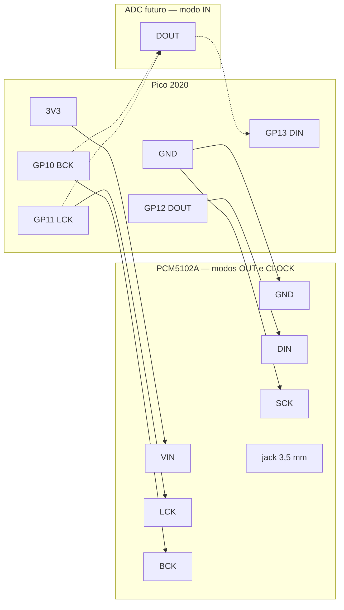

# Casio SA-1 → MIDI

**Agora: banco de testes no browser** (`lab/run.sh`) — sem Arduino IDE. Matriz: [Etapa 1](ETAPA-1.md) · [solda MCP](hardware/SOLDA-MCP.md) · circuito 1:1 [hardware/MATRIZ.md](hardware/MATRIZ.md). Periféricos: [Etapa 2](ETAPA-2.md).

A placa `M3210-MAIM(F)` continua no teclado. O `MCP23017` lê a matriz; o **Raspberry Pi Pico 2020** manda USB-MIDI, lê os dois EC11 e o joystick KY-023, e mostra estado no OLED 0.91". O **PCM5102A** fica no I2S para o synth no próprio Pico — som sem computador.

Peças desta montagem: Pico 2020, 2× EC11 sem clique, joystick KY-023, **CJMCU-2317** (MCP23017 I2C), OLED 0.91" SSD1306 (128×32, 4 pinos), barra **WS2812 8×1** (5050, 4–7 V), DAC **PCM5102A** (jack 3,5 mm LINE OUT).

## Quem faz o quê

| Peça | Papel |
| --- | --- |
| **CJMCU-2317 (MCP23017)** | 15 fios da matriz (7 KO + 8 KI). Até o Pico: VCC, GND, SDA, SCL + RESET e A0–A2 |
| **Pico 2020** | USB-MIDI + OLED + 2 encoders + joystick + I2S para o DAC |
| **2× EC11 sem clique** | Oitava e volume (CC 7). Sem switch — programa pelos botões 0–9 da placa |
| **Joystick KY-023** | X = pitch bend, Y = CC 1 (mod), clique = sustain (CC 64) |
| **OLED 0.91" SSD1306** | 128×32 I2C. Oitava, volume, programa, última nota, sustain |
| **WS2812 8×1 (5050)** | Barra RGB. Só ligação por agora — o firmware ainda não acende |
| **PCM5102A** | DAC I2S. Jack 3,5 mm. Software escolhe o modo da porta: **saída**, **clock** ou **entrada** |

O `M6387` original sai da matriz. O som interno do Casio some. A porta de áudio (jack do PCM5102A) é escolhível no software: saída de synth, clock analógico, ou entrada (entrada precisa de ADC extra — o chip só faz DAC).

## Isolar o chip

1. Lado dos componentes: SDIL de 30 pinos, pino 1 na marca/chanfro.
2. Corte as trilhas (ou levante os pinos) **11–18** e **24–30**.
3. Solde no lado da **matriz**, não no pino do chip.
4. GND comum (pino 7 ou negativo das pilhas). Pico / MCP só em **3,3 V**.

## Ligação

Varredura **ativa em LOW** (pull-up do MCP). A borracha só curto-circuita KO↔KI; a polaridade é invertida em relação ao Casio original, os fios são os mesmos.

### CJMCU-2317 (MCP23017) ↔ Casio

Chip `MCP23017-E/SS`, I2C até 1,7 MHz. O firmware usa 400 kHz. 1,8–5,5 V — no Pico use **3V3**.

O verso do CJMCU (header 2×10) escreve `B0/A0`–`B7/A7`: cada linha é **dois furos** (GPB | GPA). `A0` `A1` `A2` da coluna esquerda são **endereço I2C**, não GPIO. Solda, ordem no ferro e lista: [SOLDA-MCP.md](hardware/SOLDA-MCP.md).

| Casio | M6387 | CJMCU-2317 |
| --- | --- | --- |
| KI0–KI7 | 11–18 | GPA0–GPA7 (lado A / “right”) |
| KO0–KO6 | 30…24 | GPB0–GPB6 (lado B / “left”) |
| GND | 7 | GND |
| — | — | VCC → 3V3 do Pico |

| Pino do módulo | Ligar em | Por quê |
| --- | --- | --- |
| SDA / SI | Pico GP0 | I2C data |
| SCL / SCK | Pico GP1 | I2C clock |
| RESET | **3V3** | Ativo em LOW. Solto = chip some do barramento |
| A0, A1, A2 | **GND** | Endereço `0x20`. Soltos = endereço instável |
| INTA, INTB | nada | Não usamos interrupção |
| NC / S0, NC / CS | nada | Só existem no MCP23S17 (SPI) |
| GPB7 | nada | Livre |

A0–A2 em VCC mudam o endereço (`0x21`…`0x27`). Se mudar, ajuste `MCP_ADDR` em `firmware/pico/config.h`.

O módulo já tem pull-up de 10 kΩ no I2C (array `103`). RESET: algumas placas já puxam com 10 kΩ; ligue mesmo assim no 3V3, sem resistor extra em paralelo.

### Pico 2020

| Sinal | GPIO |
| --- | --- |
| SDA | GP0 |
| SCL | GP1 |
| EC11 oitava A / B | GP18 / GP19 |
| EC11 volume A / B | GP21 / GP22 |
| KY-023 VRx / VRy / SW | **GP26_A0** / **GP27_A1** / GP20 |
| KY-023 +5V | **3V3** (não use 5 V no Pico) |
| WS2812 IN | GP16 |
| WS2812 VCC | **VBUS (5 V)** — não use 3V3 |
| WS2812 IN | GP16 — tempo 1–4 (MIDI Clock) ou banco no SEL |
| PCM5102A BCK / LCK / DIN | GP10 / GP11 / GP12 |
| PCM5102A SCK | **GND** (PLL interno — não é o SCK do OLED) |
| I2S DIN (ADC futuro) | GP13 — livre; modo **entrada** da porta |
| 3V3, GND | MCP + OLED + encoders + joystick + PCM5102A (+ GND da barra WS2812) |
| OLED SDA | GP0 (mesmo SDA do MCP) |
| OLED SCK | GP1 (silk **SCK** = SCL; mesmo clock do MCP) |

EC11: três pinos. O do meio (C) no GND; A e B nos GPIOs. `INPUT_PULLUP`, sem resistor extra.

O silk do KY-023 diz `+5V` (às vezes `VCC`), mas é só o VCC dos potenciômetros de ~10 kΩ. No Pico ligue em **3V3**. Se ligar em 5 V, VRx/VRy passam de 3,3 V e queimam o ADC. ADC no Pico (lado da solda): **GP26_A0** = VRx, **GP27_A1** = VRy, **GP28_A2** livre. No boot o firmware calibra o centro — deixe o stick solto ao ligar. Eixo invertido: `JOY_INVERT_X` / `JOY_INVERT_Y` em `config.h`.

### OLED 0.91" (SSD1306 128×32)

Quatro pinos: **GND, VCC, SCK, SDA**. O silk `SCK` é o SCL do I2C — não é SPI. Entra no **mesmo barramento** do CJMCU-2317 (endereços diferentes: MCP `0x20`, OLED `0x3C`).

| OLED | Pico |
| --- | --- |
| GND | GND |
| VCC | **3V3** (não use 5 V) |
| SDA | GP0 |
| SCK | GP1 |

O módulo já traz pull-up. Sem fio extra de RESET. Se a sonda imprimir `OLED 0x3D`, mude `OLED_ADDR` em `firmware/pico/config.h`. Sem o display o firmware segue; só não atualiza a tela.

A tela mostra bancos P/B (1–8), oitava, volume (barra), programa ou pulso do clock (`1.-.-.-`), e a última nota. Com SEL: `BANK n`. Clique do joystick = `S` (sustain).

### WS2812 8×1 (5050)

Barra de 8 LEDs em linha. Silk do lado de entrada: **SND · IN · VCC · GND**. (`SND` = terra. `IN` = dados.) O outro extremo é só para encadear outra barra (**DOUT**) — deixe solto.

| Barra | Pico |
| --- | --- |
| SND | GND |
| IN | GP16 |
| VCC | **VBUS** (5 V no USB) |
| GND | GND |
| DOUT | nada |

`IN` aceita 3,3 V na prática. Se as cores saírem erradas, um resistor de 330 Ω entre GP16 e IN. Brilho no máximo puxa ~60 mA por LED — 8 brancos chegam a ~0,5 A; por isso **VBUS**, não o 3V3 do Pico.

Pino e quantidade: `WS_PIN` / `WS_COUNT` em `firmware/pico/config.h`.

### PCM5102A — porta OUT / CLOCK / IN

Módulo roxo, chip `PCM5102A`, jack **3,5 mm LINE OUT**. Fileira de cima: **VIN · GND · LCK · DIN · BCK · SCK**. Lado direito: pads **1 2 3 4** e saídas **G R G L** (o mesmo sinal do jack).

O PCM5102A **só faz DAC** (digital → analógico). O software escolhe o modo da porta (`AudioPortMode` em `firmware/pico/config.h` / `audio.h`). A UI (OLED + encoder) entra depois; o default é saída.

| Modo | O que o jack faz | Hardware |
| --- | --- | --- |
| **Saída** | Synth / line out estéreo | PCM5102A agora. Nível de linha: fone ativo, caixa com amp, ou depois o amp do SA-1 |
| **Clock** | Pulso/click de sync (BPM) no mesmo jack | Mesmo DAC, outro programa — square/click em vez de synth |
| **Entrada** | Line in | **Não é este módulo.** Precisa de um ADC (ex. PCM1808) no mesmo BCK/LRCK, dados no **GP13**. Não ligue uma fonte no jack do PCM5102A — é saída, queima o chip |

O Pico gera I2S por PIO. `I2S.setBCLK(10)` usa GP10 = BCK e **GP11 = LCK** (tem de ser BCK+1). GP12 = dados para o DAC. GP13 fica reservado para dados de um ADC.



| PCM5102A | Pico | Por quê |
| --- | --- | --- |
| VIN | **3V3** | O módulo tem LDO. 3,3–5 V. No Pico use 3V3 |
| GND | GND | GND comum |
| LCK | **GP11** | Word clock (LRCK). Tem de ser GP10+1 |
| DIN | **GP12** | Dados I2S (Pico DOUT → DIN do DAC) |
| BCK | **GP10** | Bit clock |
| SCK | **GND** | Sem MCLK do Pico: o chip gera o clock no PLL. Solto = silêncio |
| 1, 2, 3, 4 | nada | Já vêm no verso (H1L–H4L). Não ligue ao I2C |
| G / R / G / L | nada | Line out paralelo ao jack. Fone passivo fica baixo; precisa amp |

**SCK deste módulo não é o SCK do OLED.** O silk do OLED é SCL do I2C (GP1). O SCK do PCM5102A é o *system clock* de áudio — vai no **GND**.

Vire o módulo e confira os quatro jumpers do verso (ponte no meio para L ou H):

| Pad | Sinal | Fábrica típica | Certo para nós |
| --- | --- | --- | --- |
| H1L | 1 FLT | L | L — filtro normal |
| H2L | 2 DEMP | L | L — sem de-emphasis |
| H3L | 3 XSMT | **H** | **H** — unmute. Se estiver em L, o jack fica mudo |
| H4L | 4 FMT | L | L — I2S (não left-justified) |

Alguns lotes trazem uma ponte **SCK–GND** na frente. Se estiver fechada, o fio SCK→GND é opcional. Se SCK ficar no ar e a ponte aberta, não sai som.

Pinos: `I2S_BCK_PIN` / `I2S_LRCK_PIN` / `I2S_DOUT_PIN` / `I2S_DIN_PIN` em `firmware/pico/config.h`. O firmware MIDI ainda **não** gera áudio. Quando o synth existir, `audioSetPortMode()` troca saída ↔ clock no jack; entrada espera o ADC no GP13. O loop de `pico.ino` hoje só varre teclas com USB montado — no modo synth/clock isso muda.

## Firmware

Arduino IDE não é necessário no dia a dia. O **Lab** no browser conecta no Serial, mostra matriz / EC11 / joystick / OLED ao vivo, manda comandos e grava o firmware.

```bash
./lab/run.sh
```

Abre `http://127.0.0.1:8741`. Escolha a porta `usbmodem` do Pico → **Conectar**.

| Botão | O que faz |
| --- | --- |
| **Gravar sonda** | Compila e envia `firmware/probe` (banco de testes) |
| **Gravar MIDI** | Compila e envia `firmware/pico` (USB-MIDI) |
| **Conectar** | Serial 115200 + stream ao vivo |

A sonda precisa estar gravada uma vez. Se ainda não tiver `arduino-cli` (`brew install arduino-cli`), grave a sonda pela IDE só nessa primeira vez; o teste em si é no Lab.

Bibliotecas (IDE ou `arduino-cli lib install`): **Adafruit MCP23017**, **Adafruit SSD1306**, **Adafruit GFX Library**, **MIDI Library**. Placa **Raspberry Pi Pico** (Earle Philhower). MIDI: `USB Stack → Adafruit TinyUSB`. A sonda usa o USB padrão (CDC).

Sem o Lab: Serial 115200 na sonda. F3 → `KO0 KI0`. C6 → `KO3 KI7`. Depois grave `firmware/pico/pico.ino` — aparece **Casio SA-1 MIDI**.

### MIDI

Canais de fábrica (tudo separado para a DAW):

| Superfície | Canal | Mensagem |
| --- | --- | --- |
| 32 teclas | **1** | Note On/Off F3–C6, oitava no EC11-1 |
| Botões 0–9 | **2** | Dual: Note On/Off (C1–A1) + CC 127/0 (CC 30–39 no banco 1) |
| Joystick | **3** | X pitch bend, Y CC 1 mod, SW CC 64 sustain |
| EC11 ×2 | **4** | EC11-1 oitava local (−2…+3); EC11-2 volume CC 7 |
| stop | — | Play/Stop da DAW (MIDI Start ↔ Stop); no Stop também limpa notas (ch 1+2) |
| demo | 1 + 2 | All Notes Off (CC 120/123) |

Bancos: SEL + EC11 esquerda = banco performance; SEL + EC11 direita = banco pads. Bancos 1–8. Tempo ± = só CC de tempo (40/41), não muda banco.

WS2812: idle mostra os dois bancos (performance vermelho, pads azul) com onda fraca nos inativos. Se P e B caem no mesmo LED, as cores **alternam**. Após mudar um banco (~2 s) ou com SEL, o banco em foco pulsa mais forte. Com Play/clock da DAW, LEDs 1–8 marcam colcheias em azul.

OLED: caixas **P**/**B**, nome da track (Mackie), acorde acumulado (ex. `G/D`), BPM e playhead `m:ss` (Mackie assignment quando disponível, senão MIDI clock).

USB-MIDI: o Pico expõe **dois cabos** — (1) Casio SA-1 (notas/CC/clock) e (2) Mackie Control. Na DAW, adiciona Control Surface = Mackie Control no 2.º porto: nome da track, tempo no display, e o botão Stop do SA-1 manda Play/Stop Mackie.

No Lab (`/midi`): modo Dual nos pads, canais editáveis, piano roll também para os botões 0–9.

## Matriz (referência)

Cobre vs MCP, SVG à escala e pares de continuidade: [hardware/MATRIZ.md](hardware/MATRIZ.md) · [m3210-maim.svg](hardware/m3210-maim.svg).

| | KI0 | KI1 | KI2 | KI3 | KI4 | KI5 | KI6 | KI7 |
| --- | --- | --- | --- | --- | --- | --- | --- | --- |
| **KO0** | F3 | F#3 | G3 | G#3 | A3 | A#3 | B3 | C4 |
| **KO1** | C#4 | D4 | D#4 | E4 | F4 | F#4 | G4 | G#4 |
| **KO2** | A4 | A#4 | B4 | C5 | C#5 | D5 | D#5 | E5 |
| **KO3** | F5 | F#5 | G5 | G#5 | A5 | A#5 | B5 | C6 |
| **KO4** | 0–4 | | | | | — | — | — |
| **KO5** | 5–9 | | | | | stop | — | — |
| **KO6** | — | | | | | demo | demo | demo |

Tempo ±, volume ± e rhythm da placa ignorados (KI5–7). Volume MIDI = EC11.

**O que não entra no mapa (confirmado em várias fontes):**

- **KO7** (toco 23): no SA-1 não varre tecla. Só detecta polifonia no boot (ligar 23↔18). [weltenschule](http://www.weltenschule.de/TableHooters/Casio_SA-1.html), [Bannister](https://forums.bannister.org/ubbthreads.php?ubb=showflat&Number=45295).
- **KO8–KO11** (pinos 22–19): NC no SA-1. Só GZ-5 / SA-65 / MA-120.
- **KO6 × KI0–4**: cópias dos botões 0–4, não funções novas. No SA-21 essa linha é pads de bateria; no SA-1 (`M6387-01`) não.
- Weltenschule escreve `B5` em KO2 KI2; entre A#4 e C5 é **B4** (já está assim no firmware).

As 32 notas estão só em KO0–KO3 × KI0–KI7 (grupos de 8). Sem KI5–7 não há A#3 B3 C4 / F#4 G4 G#4 / D5 D#5 E5 / A#5 B5 C6 — não existe outro sítio na placa.

[Hardware SA-1](http://www.weltenschule.de/TableHooters/Casio_SA-1.html). Sem diodos: acorde de 3+ notas no mesmo retângulo pode fantasma.
