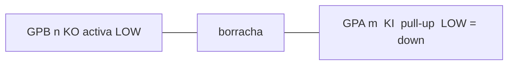

# Matriz SA-1 — `M3210-MAIM(F)`

Circuito no cobre e o que esta unidade já aprendeu no MCP. Vetor 1:1: [m3210-maim.svg](m3210-maim.svg) (1 unidade = 1 mm; face de solda, grave à esquerda).

Jump dos cambos: [SOLDA-MCP.md](SOLDA-MCP.md). Isolar o chip e a sonda: [Etapa 1](../ETAPA-1.md). Firmware: `firmware/pico/matrix.h`.

## Duas folhas, não uma

| Folha | O que descreve | Usar para |
| --- | --- | --- |
| **Casio / cobre** | Pinos do `M6387` × palhetas | Soldar, continuidade, pino 1 |
| **MCP / aprendido** | O que o Pico lê em GPB/GPA | MIDI, Lab, `matrix.h` |

São o mesmo cruzamento KO↔KI na borracha. Se o pino 1 ou os cambos 29/27 estiverem trocados, as **células MCP** deixam de coincidir com os **nomes Casio**. Não reescreva o firmware para a tabela Casio sem medir os sete pares abaixo.

## Topologia (fotos desta placa)

Placa de uma face: cobre + jumpers de **carbono**. Cada palheta tem dois pentes; a borracha une **um KO** a **um KI**. Não fecha contra o GND (pino 7).

- **32 teclas** na borda longa, grupos de 8 (F3–C4, C#4–G#4, A4–E5, F5–C6).
- **Barramento de 8 trilhas** = KI0–KI7. Traços pretos que o atravessam = pontes de carbono (KO).
- **Botões** na borda oposta. Tempo ±, volume ± e rhythm da placa **ignorados** (volume MIDI = EC11).
- **KO7** (toco 23) no SA-1 não varre tecla.

Pinos:

| Função | M6387 |
| --- | --- |
| KI0–KI7 | 11, 12, 13, 14, 15, 16, 17, 18 |
| KO0–KO6 | 30, 29, 28, 27, 26, 25, 24 |
| GND | 7 |
| KO7 | 23 — ignorar |

Chanfro = pino 1 no **lado dos componentes**. No verso a contagem está espelhada. A placa pode ter pads extra nos cantos (footprint “34 pinos”) ligados aos cantos reais — não os conte como pino 1.

## Mapa Casio (cobre / SM)

Família `M3210` (PK-5 SM) + [weltenschule SA-1](http://www.weltenschule.de/TableHooters/Casio_SA-1.html). KO2 KI2 é **B4**, não B5.

|  | KI0 p.11 | KI1 12 | KI2 13 | KI3 14 | KI4 15 | KI5 16 | KI6 17 | KI7 18 |
| --- | --- | --- | --- | --- | --- | --- | --- | --- |
| **KO0 p.30** | F3 | F#3 | G3 | G#3 | A3 | A#3 | B3 | C4 |
| **KO1 p.29** | C#4 | D4 | D#4 | E4 | F4 | F#4 | G4 | G#4 |
| **KO2 p.28** | A4 | A#4 | B4 | C5 | C#5 | D5 | D#5 | E5 |
| **KO3 p.27** | F5 | F#5 | G5 | G#5 | A5 | A#5 | B5 | C6 |
| **KO4 p.26** | 0 | 1 | 2 | 3 | 4 | tempo+ | vol+ | rhythm |
| **KO5 p.25** | 5 | 6 | 7 | 8 | 9 | stop | tempo− | vol− |
| **KO6 p.24** | 0\* | 1\* | 2\* | 3\* | 4\* | demo | demo | demo |

`*` = cópia na PCB, muitas vezes sem borracha.

Jump se o pino 1 estiver certo: 11–18 → GPA0–7, 30…24 → GPB0–6, 7 → GND.

## Mapa aprendido (esta unidade, 2026-08-31)

`matrix.h` / Lab. KI5–7 do piano e botões 0–4 ainda **teóricos** (saltados no aprender).

|  | KI0 | KI1 | KI2 | KI3 | KI4 | KI5 | KI6 | KI7 |
| --- | --- | --- | --- | --- | --- | --- | --- | --- |
| **KO0** | F3 | F#3 | G3 | G#3 | A3 | A#3 ○ | B3 ○ | C4 ○ |
| **KO1** | A5 | G#5 | G5 | F#5 | F5 | A#5 ○ | B5 ○ | C6 ○ |
| **KO2** | C#5 | C5 | B4 | A#4 | A4 | D5 ○ | D#5 ○ | E5 ○ |
| **KO3** | F4 | E4 | D#4 | D4 | C#4 | F#4 ○ | G4 ○ | G#4 ○ |
| **KO4** | 0 ○ | 1 ○ | 2 ○ | 3 ○ | 4 ○ | — | — | — |
| **KO5** | 5 | 6 | 7 | 8 | 9 | stop | — | — |
| **KO6** | — | — | — | — | — | demo | — | — |

○ = não fechado com DOWN. KO0 bate com o Casio. Nas outras três oitavas: **KO1↔KO3** e **KI0–4 invertidos** (serpentina no cobre, ou cambos 29↔27).

## Sete pares (continuidade)

Pilhas e USB **fora**. Preta no KO, vermelha no KI, apertar:

| Apertar | Casio (cobre) | Se vier o aprendido |
| --- | --- | --- |
| F3 | **30 ↔ 11** | igual |
| C4 | **30 ↔ 18** | igual se KI7 ok |
| C#4 | **29 ↔ 11** | **27 ↔ 15** → 29/27 trocados |
| C6 | **27 ↔ 18** | **29 ↔ 18** no mesmo caso |
| 0 | **26 ↔ 11** | |
| stop | **25 ↔ 16** | |
| demo | **24 ↔ 16** (ou 17/18) | |

Anote linha a linha (`F3  30↔11  ok`). Uma tecla, um par. Ω da borracha ~100–2 kΩ; ~0 Ω = curto de solda.

## Confiança

| Nível | O quê |
| --- | --- |
| Alta | 8×4 piano, pinos KI/KO, KO7 NC, palheta ≠ GND, SM `M3210` = esta placa |
| Média | KO0 = Casio nesta unidade; stop/demo/5–9 no MCP; X dos botões no SVG |
| Aberta | KI5–7 das 32 teclas; botões 0–4 |

Regenerar o SVG: `python3 hardware/gen_m3210_svg.py`.
