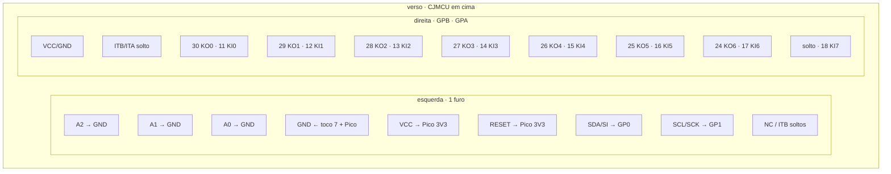

# Solda da matriz → CJMCU-2317

Bancada: 16 fios da `M3210-MAIM(F)` no **CJMCU-2317** (MCP23017) e 5 fios do módulo no Pico. Mapa das teclas: [MATRIZ.md](MATRIZ.md). Isolar o `M6387` e a sonda: [Etapa 1](../ETAPA-1.md).

Pilhas e DC 6 V **fora**. USB do Pico **fora** enquanto solda. Só **3,3 V** — nunca VBUS.

Folha do verso do módulo: [cjmcu-2317-solda.svg](cjmcu-2317-solda.svg).

## O que vai (16 + 5)

| Quantos | De | Para |
| --- | --- | --- |
| 8 | tocos **11–18** (KI0–7) | **GPA0–7** (furo **A**, perto do texto `Bn/An`) |
| 7 | tocos **30…24** (KO0–6) | **GPB0–6** (furo **B**, o outro do par) |
| 1 | toco **7** (GND) | **GND** do módulo |
| 5 | silk esquerda do CJMCU | Pico: VCC→3V3, GND, SDA→GP0, SCL→GP1, RESET→3V3 |

**Não solde:** toco **23** (KO7), **GPB7**, `ITB/ITA`, `NC/SO`, `NC/CS`.

## 0. Pino 1 e isolamento

Lado dos **componentes**. Chanfro / ponto do `M6387` = pino 1. **Marque com caneta antes de virar** — no verso a contagem está espelhada. Pads extra nos cantos (footprint “34”) não são o pino 1.

O MCP não partilha o barramento com o OKI. **Tire o chip** (corte os 30 pinos rente ao corpo, dessolde os tocos). Deixe os tocos 11–18, 24–30 e 7 no furo e solde os cambos **aí**, lado da matriz.

Sem o chip, toco 7 **não** apita com tecla premida. Isso é normal: a borracha só une KO↔KI.

## 1. Folha do CJMCU (verso)

Texto **`CJMCU` legível**. Header 2×10.

- Coluna **esquerda**: um furo por linha. `A0` `A1` `A2` daqui são **endereço I2C**, não GPIO.
- Coluna **direita**: cada silk `B0/A0` … `B7/A7` é **dois furos**. **Perto do texto = GPA**. O outro = **GPB**.

A ordem exacta SCL/SDA/NC na esquerda segue o **silk**, não este bloco. Os três endereço em cima e os pares `B0/A0`… batem com esta placa.

Cores (sugestão): KI **azul**, KO **laranja**, GND **preto**, 3V3 **vermelho**, SDA **branco**, SCL **amarelo**.

## 2. Ordem no ferro

Não comece pelos 15 fios da matriz. Primeiro o módulo fala I2C; depois a Casio.

| # | Soldar | Confere |
| --- | --- | --- |
| 1 | `A0` `A1` `A2` → GND do **módulo** (cambos curtos) | |
| 2 | `RESET` → VCC do **módulo** (cambo curto) | |
| 3 | `VCC` → Pico **3V3**, `GND` → Pico GND, `SDA/SI` → **GP0**, `SCL/SCK` → **GP1** | USB, sonda: `MCP OK em 0x20` |
| 4 | Toco **7** → GND do módulo (mesmo terra do Pico) | |
| 5 | **KI** 11→GPA0 … 18→GPA7 | Cada fio: continuidade toco↔furo A, **não** ao furo B |
| 6 | **KO** 30→GPB0 … 24→GPB6 | Cada fio: toco↔furo B, **não** ao A |
| 7 | USB fora. F3 premida: 30↔11 ~100 Ω–2 kΩ | Sem tecla = aberto |

Se o passo 3 falhar (`0x21`…`0x27`): A0–A2 não estão todos no GND. LED a piscar: VCC, GND, RESET, SDA/SCL. **Não** avance aos KI/KO.

## 3. Lista — tocos → furos

Verso, `Bn/An`. Um par por linha. GPA primeiro (KI), depois GPB (KO).

| ☐ | Toco LSI1 | Sinal | Silk | Furo |
| --- | --- | --- | --- | --- |
| | 11 | KI0 | B0/A0 | **GPA** |
| | 12 | KI1 | B1/A1 | **GPA** |
| | 13 | KI2 | B2/A2 | **GPA** |
| | 14 | KI3 | B3/A3 | **GPA** |
| | 15 | KI4 | B4/A4 | **GPA** |
| | 16 | KI5 | B5/A5 | **GPA** |
| | 17 | KI6 | B6/A6 | **GPA** |
| | 18 | KI7 | B7/A7 | **GPA** |
| | 30 | KO0 | B0/A0 | **GPB** |
| | 29 | KO1 | B1/A1 | **GPB** |
| | 28 | KO2 | B2/A2 | **GPB** |
| | 27 | KO3 | B3/A3 | **GPB** |
| | 26 | KO4 | B4/A4 | **GPB** |
| | 25 | KO5 | B5/A5 | **GPB** |
| | 24 | KO6 | B6/A6 | **GPB** |
| | 7 | GND | GND | coluna esquerda |

`B7/A7` lado **GPB** vazio. Toco 23 vazio.

| ☐ | CJMCU | Pico |
| --- | --- | --- |
| | VCC | **3V3** |
| | GND | GND |
| | SDA/SI | GP0 |
| | SCL/SCK | GP1 |
| | RESET | **3V3** |
| | A0 A1 A2 | GND (no próprio módulo) |

## 4. Depois da solda (USB fora)

Continuidade, ohms, **não** volts. Uma tecla de cada vez.

| Premir | Apita entre | MCP |
| --- | --- | --- |
| F3 | **30 ↔ 11** | KO0 KI0 |
| C4 | **30 ↔ 18** | KO0 KI7 |
| C#4 | **29 ↔ 11** | KO1 KI0 |
| C6 | **27 ↔ 18** | KO3 KI7 |
| 0 | **26 ↔ 11** | KO4 KI0 |
| stop | **25 ↔ 16** | KO5 KI5 |
| demo | **24 ↔ 16** (ou 17/18) | KO6 |

Ω da borracha ~100–2 kΩ. ~0 Ω = curto de solda. Apito **sem** tecla = dois cambos a tocar (quase sempre o par `Bn/An` no mesmo silk).

C#4 em **27↔15** em vez de 29↔11: cambos **29 e 27** trocados. Ou deixa o mapa aprendido em `matrix.h`, ou troca os dois fios — não os dois.

## 5. Sonda

`firmware/probe` · Serial 115200 · Lab `./lab/run.sh`.

| Vê | Significa |
| --- | --- |
| `MCP OK em 0x20` | I2C certo; pode tocar tecla |
| F3 → `KO0 KI0` | KI0 e KO0 no sítio |
| C6 → `KO3 KI7` | o outro canto do piano |
| `0x21`… | endereço; A0–A2 |
| duas células no mesmo `held` | curto GPA ou GPB |

Aí: [Etapa 2](../ETAPA-2.md).

## Erros que queimam o dia

| Erro | Efeito |
| --- | --- |
| Fio no `A0` da **esquerda** em vez do GPA0 de `B0/A0` | endereço a flutuar / tecla muda |
| KI no furo **B** | KO e KI trocados nesse bit |
| 29 e 27 invertidos | C#4… vs F5… no MCP (já visto nesta unidade) |
| 16/17/18 no GPB | A#3 B3 C4 mudos |
| RESET solto | MCP some do I2C |
| 5 V no VCC | risco no Pico e no MCP |
| OKI ainda no soquete | dois chips no mesmo KI/KO |
